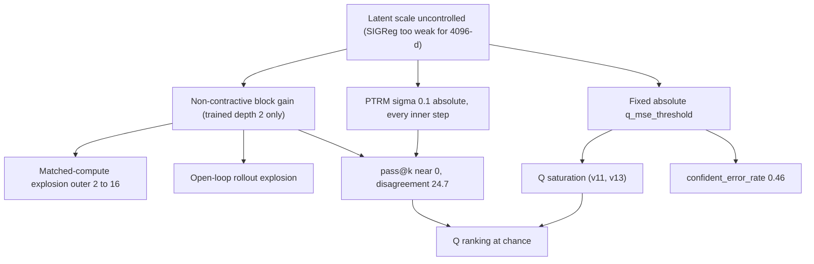

# 05 — TRM recursion depth, SIGReg, and Q-calibration interactions affecting rollout stability

Status: research plan only. No code changes proposed for immediate execution;
the ranked experiment matrix at the end is the deliverable.

## Scope and sources

Question: why does deterministic matched-compute MSE explode with outer steps,
why is PTRM `pass@k` near zero on v15, and why does the Q head stay
miscalibrated (`confident_error_rate` ~46%) — and how do the three knobs
(recursion depth, SIGReg, Q training) interact?

Grounding used here:

- Code: [`src/p2/model.rs`](../../../src/p2/model.rs) (`run_recursion`,
  `deep_step`, `maybe_noise_z`), [`src/p2/train.rs`](../../../src/p2/train.rs)
  (`leworld_loss`, Q surprise, `ptrm_ranking_loss`),
  [`src/p2/sigreg.rs`](../../../src/p2/sigreg.rs),
  [`src/p2/eval.rs`](../../../src/p2/eval.rs) (matched compute, `q_surprise`).
- Data: `p2-output-v11-control/eval_report_64ep_v3.json`,
  `p2-output-v15/eval_report_64ep_v5.json`, `p2-output-v15/config.json`.
- Docs: [`docs/P2.md`](../../P2.md), [`docs/P2_V13.md`](../../P2_V13.md),
  [`docs/P2_V15.md`](../../P2_V15.md), [`docs/P2_V16.md`](../../P2_V16.md).
- Papers: TRM (arXiv 2510.04871) and LeJEPA-lineage SIGReg from prior
  knowledge; PTRM (arXiv 2605.19943) and LeWorldModel (arXiv 2603.19312) could
  not be fetched this session (web access declined), so their recipes are
  cited through the repo research contract in `docs/P2.md`. Claims that need
  paper verification are marked **[verify]**.

## 1. Observed failure surface (grounded numbers)

Deterministic matched compute (`forward_with_outer_steps`, trained depth
`outer_steps=2`, `inner_steps=2` in both runs):

| outer steps | v11-control (dense 128-d) | v15 (spatial 64x8x8 = 4096-d) |
|---|---|---|
| 2 (trained) | 0.026 | 0.80 |
| 4 | 1.60 | 137 |
| 8 | 3.14 | 4.0e6 |
| 16 | 1.68e6 | 5.4e15 |

PTRM at frozen noise 0.1 (dynamics split):

| metric | v11-control | v15 |
|---|---|---|
| pass@1 (deterministic) | 0.997 | 0.62 |
| pass@2 with noise | 0.998 | 0.000 |
| trajectory disagreement | 1.31 | 24.7 |
| q_oracle_rank@2 / @4 / @8 | 0.50 / 0.24 / 0.11 | 0.49 / 0.23 / 0.10 |

Two headline facts that the version docs do not state explicitly:

1. **Q ranking is exactly at chance.** `q_oracle_rank_accuracy ~ 1/k` in both
   v11 and v15. The Q head has never provided usable ranking signal among PTRM
   candidates; "PTRM noise helps ranking" has not actually been demonstrated
   by any run so far.
2. **v15 latents ran at ~5.7x unit scale.** `latent_covariance_frobenius`
   = 2090 for a 4096-dim latent; an isotropic unit Gaussian would give ~64
   (sqrt(dim)). SIGReg at weight 0.01 did not control scale. This one number
   couples all three failures: the same non-contractive block amplification
   acts on (a) depth-extrapolation error, (b) injected PTRM noise, and (c) the
   MSE scale that Q thresholds are defined against.

Q / calibration:

- v11 (`q_mse_threshold=0.25`, one-step MSE 0.026): positive label rate 0.997,
  balanced accuracy 0.50, `saturated=true` — threshold far above the error
  distribution, all-positive labels.
- v13 (`q_mse_threshold=0.05` on the same architecture) saturated again per
  the v13 post-mortem — the threshold is a fixed point cutting a
  **nonstationary** MSE distribution; wherever it is placed, training drifts
  the distribution to one side of it.
- v15 (`threshold=0.05`, one-step MSE 0.80): positive rate 0.62, balanced
  accuracy 0.77, mean Q 0.39 unreliable vs 0.91 reliable, but
  `confident_error_rate=0.457`. Separation exists; the decision threshold and
  probability scale are miscalibrated, not absent.
- v15 open-loop rollout explodes (1157@4, 1.5e11@8) while closed-loop is sane
  (0.91@4, 2.74@8): the error is latent self-feeding, not per-step prediction.

## 2. Mechanism analysis

### 2.1 Recursion depth and error stacking

The recursion (`run_recursion` / `deep_step`,
[`src/p2/model.rs`](../../../src/p2/model.rs) lines ~448-531):

```text
repeat outer:  { repeat inner: z = block(x + y + z [+ noise]) };  y = rms_norm(block(y + z)) }
```

Training (`leworld_loss`) averages next-latent MSE over the outer steps that
were actually run — depth 2. Nothing constrains `y -> block(y+z)` to be a
contraction, or the target latent to be a fixed point of the operator. The
`block` is a residual MLP `h + MLP(h)`, so its Jacobian is `I + J_mlp`; unit-
plus-something spectral radius iterated off the training manifold gives the
observed geometric blowup. Steps 3+ feed the block `y` values it has never
seen; each extra step compounds by roughly the operator gain (v11: ~60x from
step 2 to 4; v15: ~170x — bigger latent, bigger scale, bigger gain).

TRM-side guidance **[verify against 2510.04871]**: TRM runs a *fixed* trained
depth with deep supervision, detaches the `(y, z)` carry between supervision
segments, and uses EMA weights; it does not claim depth extrapolation. Running
`k * outer_steps` at eval (the matched-compute probe) is therefore evaluating
the model strictly outside its training contract. Two remedies exist:

- **Train the depths you evaluate.** `TrainConfig.randomize_depth` already
  exists (currently false everywhere). Sampling outer depth per batch from
  {2..8} with per-step supervision teaches the operator to be approximately
  idempotent at the target ("once converged, stay put") — the cheapest,
  most direct fix.
- **Make the target a fixed point explicitly.** An idempotence penalty
  `||block(rms_norm(y_target) + z) - y_target||` (deep-equilibrium flavored)
  achieves the same without depth randomization, at the cost of a new loss
  term.

The v16 per-step `rms_norm_latent(y)` (already in tree, line ~512) bounds the
scale of the iterate but not the direction drift — it converts explosion into
wandering on the unit-RMS sphere. Expect v16 matched-compute to plateau at
"garbage of bounded norm" (MSE ~2 for unit-RMS random latents) instead of
1e15. That is necessary but not sufficient.

### 2.2 SIGReg tuning for spatial latents

`sigreg_epps_pulley_seeded` flattens the spatial latent to `B x 4096` and
tests `num_slices=8` random unit projections against N(0,1) at 5 knots. Three
observations:

- **Slice budget vs dimension.** 8 slices in 4096 dims is an extremely sparse
  sketch per step. Reseeding every step gives Monte Carlo coverage across
  training **[LeJEPA argues this suffices — verify]**, but the per-step
  gradient signal on any given direction is ~1/512 of what the 128-dim v11
  latent enjoyed at the same slice count. The v15 scale blowout (Frobenius
  2090) is consistent with SIGReg being too weak *per dimension*, not merely
  down-weighted.
- **Flattened vs per-position statistic.** Flattening treats every
  (channel, y, x) as a dimension of one distribution. For a conv latent, the
  natural alternative is per-position: reshape to `(B*H*W) x C` and test the
  64-dim channel distribution, where 8-16 slices is a reasonable sketch and
  the "batch" grows 64x. This matches what the dynamics block actually
  consumes (per-patch channel vectors) and is a one-line reshape.
- **Division of labor with RMS norm (v16).** Per-sample RMS norm fixes global
  scale; SIGReg's remaining job is shape/isotropy across the batch. These are
  compatible, but it means the v15-vs-v16 weight change (0.01 -> 0.003) is
  confounded with the norm change — the weight sweep only makes sense with
  the norm held fixed.

### 2.3 Q head: targets, gradient paths, training order

Current wiring in `leworld_loss` ([`src/p2/train.rs`](../../../src/p2/train.rs)
lines ~1327-1346):

- Targets: `per_sample_mse(y, next_z).detach() < q_mse_threshold` — a fixed
  absolute threshold on a nonstationary error distribution. This is the root
  cause of both saturation modes (v11 all-positive, v13 re-saturation).
- Gradients: the Q BCE flows **into the dynamics** through `q_logit(pool(y))`
  (P2.md: "Q keeps full gradients from predicted y"). The model can reduce Q
  loss by moving `y`, which is a perverse incentive coupled to the same `y`
  the MSE loss owns.
- Surprise term: `0.1 * mean(sigmoid(q) * mse_per(y, next_z))` with **live**
  MSE — it is simultaneously (a) a calibration penalty on Q and (b) an extra
  Q-weighted MSE gradient on `y`. Its degenerate minimum is `q -> 0`
  everywhere, opposed only by the BCE.
- Order: Q ramps in `q_calibration` on stable dynamics, but then trains
  through `falsification`/`retarget` while the dynamics distribution shifts
  under it (v16 removed retarget from defaults for exactly this reason).

Fixes to test, from the calibration literature (PETS/calibrated model-based
RL prescriptions: recalibrate on held-out data; use ensemble/sample
disagreement as the epistemic signal):

- **Relative or quantile targets:** label = "MSE below the batch quantile"
  (balanced by construction, threshold-free), or regress `log(mse)` and derive
  the accept/reject decision at eval time.
- **Detach `y` in the Q path** (both BCE and surprise): Q becomes a pure
  observer, dynamics gradients stay owned by the MSE/rollout losses.
- **Post-hoc Platt scaling** of the Q logit on a held-out synthetic split —
  the cheapest possible fix for `confident_error_rate`, needs no retraining.
- **Pairwise ranking loss within PTRM candidates** — Q's actual downstream
  job is ranking; the current `ptrm_ranking_loss` (weight 0.05, cadence every
  4 steps) trains best-of-K selection but the chance-level
  `q_oracle_rank_accuracy` shows it is not working; a margin ranking loss on
  detached per-trajectory MSE is the direct formulation.

### 2.4 PTRM noise schedule

`maybe_noise_z` injects sigma=0.1 Gaussian **before every inner z-update**
(4 injections at trained depth), with the same fixed sigma at train (rank-loss
cadence only) and eval. Problems:

- **Absolute sigma against unnormalized z.** `z` has no norm constraint; the
  effective signal-to-noise ratio is uncontrolled and drifted badly in v15
  (disagreement 24.7 means trajectories land ~25 MSE apart — pure noise
  amplification through the same non-contractive Jacobian as section 2.1).
- **Noise at every step fights convergence.** Re-injecting at each inner step
  never lets the recursion settle. The alternative consistent with a
  "sample-then-refine" reading of PTRM **[verify against 2605.19943]** is to
  perturb once (first inner step of the first outer step) or anneal sigma to
  zero over outer steps, letting later refinement denoise — the diffusion-like
  schedule.
- **Train/test mismatch.** The forward pass used by the MSE loss always runs
  sigma=0; the model never learns to contract noise. Either train with small
  z-noise on a fraction of batches (denoising training) or accept that eval
  sigma must be tiny.

All of this is sweepable at eval time with existing flags (`--ptrm-noise`,
`--ptrm-k`) before any retraining.

### 2.5 Interaction map



Reading: fix scale (RMS norm + SIGReg placement) and contraction (depth
randomization) first; they gate everything downstream. Q calibration and PTRM
noise tuning done before that would be tuned against a moving target.

## 3. Ranked experiment matrix

Ranking = expected information per GPU-hour. E0/E1 are eval-only (minutes on
existing or in-flight checkpoints); E2-E4 are single-run retrains (~50 min
each at v15 throughput, 6 lessons x 4096 steps x ~120 ms); E5-E7 are loss/
schedule changes. Each experiment states its gate; a failed gate still ranks
because it kills a hypothesis.

| # | Experiment | Change | Cost | Gate |
|---|---|---|---|---|
| E0 | PTRM noise sweep, eval-only | `--ptrm-noise` in {0.003, 0.01, 0.03, 0.1} x k {2,4,8} on the v16 checkpoint | minutes | some sigma with disagreement > 0 and pass@2 >= pass@1 |
| E1 | v16 matched-compute baseline | run `scripts/p2_v16_train_eval.sh` as-is (RMS norm active) | 1 run | matched-compute@16 bounded (~O(1), not 1e6); quantifies how much of the explosion was pure scale |
| E2 | Depth randomization | `randomize_depth=true`, outer sampled 2..8, per-step supervision unchanged | 1 run | matched-compute flat within 2x from 2 to 16 steps; rollout@8 not worse than E1 |
| E3 | Q target reparameterization | batch-quantile labels (or log-MSE regression) + detach `y` in Q BCE and surprise paths | 1 run | balanced accuracy > 0.85, not saturated, confident_error_rate < 0.2 |
| E4 | SIGReg placement for spatial latents | per-position statistic ((B*H*W) x C) at slices {8, 32}; weight held at 0.003 | 1 run | covariance Frobenius within 2x of sqrt(dim); one-step MSE not regressed |
| E5 | Single-injection / annealed PTRM noise | inject only at first inner step of first outer step (or sigma linearly to 0 across outer steps); best sigma from E0 | small code + eval | pass@4 > pass@1 with ranking gap <= 0.02 |
| E6 | Noise-aware training + pairwise Q ranking | z-noise (E5 schedule, E0 sigma) on 50% of training forwards; replace best-of-K rank loss with margin ranking on detached per-trajectory MSE | 1 run | q_oracle_rank@4 > 0.4 (chance 0.25) |
| E7 | Idempotence penalty | add `lambda * per-sample MSE(block(rms_norm(y_target)+z), y_target)`; only if E2 gate fails | 1 run | same gate as E2 |

Sequencing constraints:

- E0 and E1 first (no training, and E1 is the baseline every later gate is
  measured against).
- E2 before E3/E5/E6: Q thresholds and noise SNR are defined against the
  error distribution that E2 changes.
- E3 and E4 are independent of each other and of E5; they can run as a
  parallel pair on the experiment chain (`scripts/p2_experiment_chain.sh`
  pattern).
- Post-norm, `q_mse_threshold` must be re-picked from the observed one-step
  MSE distribution of the E1/E2 checkpoint (the 0.05 vs 0.25 history is
  meaningless across latent-scale regimes); record the chosen value with the
  run per the `docs/RESULTS_P2.md` update rule.

## 4. Open verification tasks (blocked on paper access)

1. PTRM (2605.19943): exact noise injection site and schedule; whether noise
   is trained-through or inference-only; recommended sigma parameterization
   (absolute vs relative to latent norm). Affects E5/E6 design details.
2. TRM (2510.04871): confirm carry detachment between supervision segments
   and EMA usage; whether any depth-extrapolation result exists. Affects
   whether E2 should also detach `(y, z)` between outer steps.
3. LeWorldModel (2603.19312): SIGReg slice count and weight used at
   comparable latent dimension; whether SIGReg is applied to flattened or
   per-position spatial latents. Affects E4 defaults.
